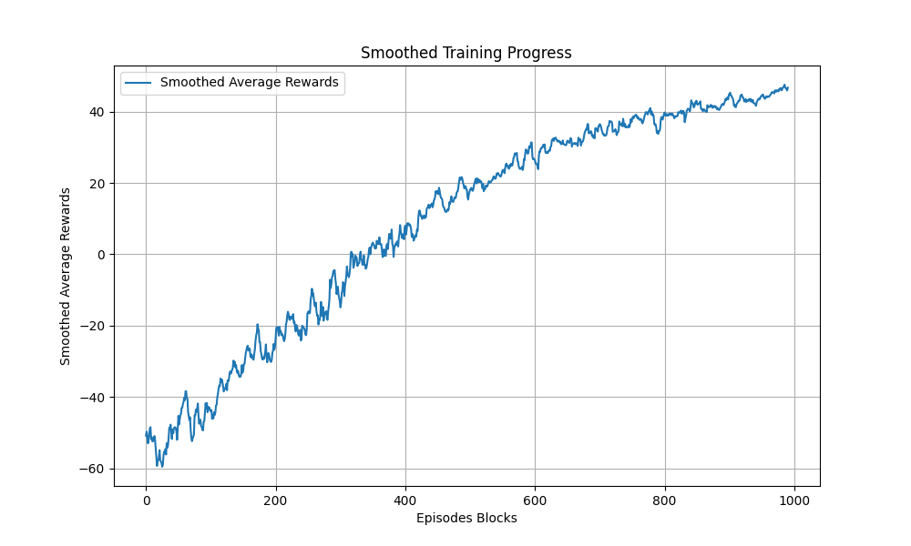
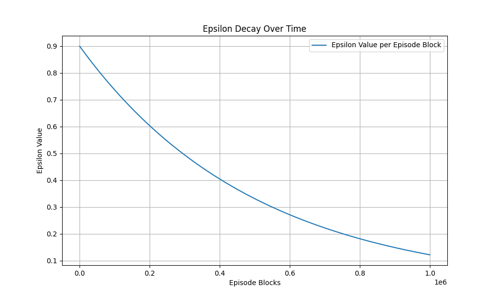

# Q-learning Blob Environment

 

This project implements a simple grid-based reinforcement learning environment where agents, represented as "blobs", navigate to achieve goals such as reaching food while avoiding enemies.
The core of the project is built around three main components: the Blob class, the QLearningAgent class, and the GameEnvironment class. The system utilizes Q-learning, a model-free reinforcement learning algorithm, to enable the agent to learn from interactions with the environment.

## Features

`-` Blob Entities: Autonomous entities that can move within a grid environment. Each blob can perform actions such as moving up, down, left, or right.

`-` Game Environment: A grid-based world where blobs interact. The environment supports spawning blobs at random locations, including food and enemies.

`-` QLearningAgent: Implements the Q-learning algorithm, allowing the blob designated as the player to learn optimal actions based on rewards received for reaching food and penalties for encountering enemies.

`-` Reward System: Configurable rewards and penalties to shape the learning behavior of the agent, including rewards for reaching food and penalties for hitting enemies or performing unnecessary moves.

`-` Visual Representation: Basic visual output using OpenCV to display the state of the environment after each action, showing the positions of the player, food, and enemies.

## Getting started

### Setting up ur parameters so that you can train your own q-learning agent:

`-` Set start_q_table = None

`-` Set ur desired BOARD_SIZE (board is always square)

`-` FULL_EPISODES = 10000 or more

`-` epsilon = 0.9 or more

`-` SHOW_EVERY = FULL_EPISODES (Trust me, you dont want to see your agent playing while training)

`-` Start training :)

### Lets visualize your q agent playing the game

`-` Set start_q_table = "name_of_your_q_table.pickle"

`-` FULL_EPISODES = 10 (or some small number)

`-` epsilon = 0 (agent does not explore)

`-` SHOW_EVERY = 1 (visual presentation of every episode)

`-` Run program to see your agent in action
